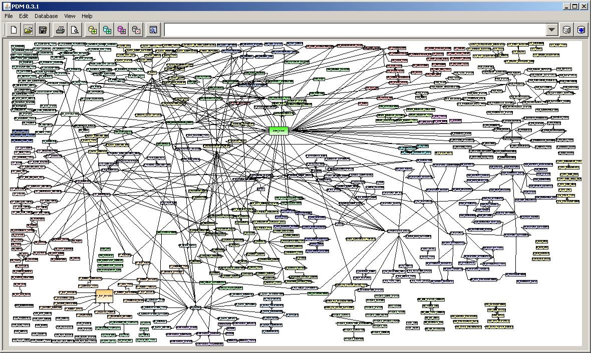

!SLIDE

# Philosophy, Squeel and Metasearch

!SLIDE

* Thibaut Assus, developer since 2007, notably with ruby + rails [http://github.com/tibastral](http://github.com/tibastral)
* Working for [milesrock.com](milesrock.com), a ruby/rails/node/js consulting company.
* Developing [feedmehq.com](http://www.feedmehq.com)
* I will talk about Squeel, or isolation / reusability / readability / maintainability

!SLIDE

# Introduction

## Why we always search for better coding horizons

!SLIDE

## Why bothering with isolation ?

* When decoupled, our code is really easier to test and to change.
* In fact, every time we refactor / isolate, it'll simplify the process of changing the code later.
* We'll also be able to share, reuse, and best of all UNDERSTAND BETTER what we are doing.

!SLIDE

## Why bothering with reusability ?

* It seems obvious, but, while programming, we should always think that doing something twice is
once too much.
* When someone can reuse what you did, you can also share it for others. And having your first pull
request accepted is something which give so much pleasure !

!SLIDE

## And readability ?

* Readability is the key to better understanding what we did. And if we understand what we did,
we'll be likely to make it even better / more scalable, etc.
* When you sell something to someone, when you know exactly what it is, it helps a lot.

!SLIDE

## Maintenability

* Some people think that the faster the better, but slow has some advantages too.
* Every time we screw our code up, we add bugs, and it'll take us a lot of time to find / fix what was wrong => then we don't have anymore time.
* It is exactly like comparing a clean desk and a crappy desk.
* When it takes you 1 second to get where we wanted to be and to fix the line we wanted to fix, we are really flexible.

!SLIDE

## Maintenability - BIS

* Think also about the programmer species... we want to be in an happy community with people recommending your work
after working with each other ?
* You are already ashamed of writing smelly code.
* We take a shower in the morning. Hygiene is be the base of our job, for your safety and others...

!SLIDE

# Squeel ?

## Given

* You have an app
* and you want to do some "creative" requests
* and you want decoupled, reusable, readable, and maintenable code

!SLIDE

### Just add the squeel gem into your Gemfile

@@@ ruby
gem "squeel"
@@@

!SLIDE

# Then you're ready to go

You want to get all the black dogs of your database :

@@@ ruby
Dog.where(:color => 'black')
@@@

with Squeel :

@@@ ruby
Dog.where{color == 'black'}
@@@

That was easy

!SLIDE

Let's search for all the black dogs that are not yorkshires

@@@ ruby
Dog.where{(color == 'black') & (race != "yorkshire")}
@@@

!SLIDE

Now let's search for all the black dogs that are not yorkshires and have an awesome dog-walker

@@@ ruby
awesome_dog_walkers = DogWalker.where{awesome == true}

Dog.where((color == 'black') & (race != "yorkshire") & dog_walker_id.in(awesome_dog_walkers.select{id})})
@@@

## And that's only one request ;)

!SLIDE

## Now let's talk about orders for a product :

I want to have every order that was payed last week and that wasn't refunded.

@@@ ruby
# order.rb
#(...)
def self.to_pay_this_week
  where{payed_at >= (Time.now.beginning_of_week - 1.day) & payed_at <= (Time.now.end_of_week - 1.day)}.where{:refund_at => nil}
end
#(...)
@@@

But don't forget that it's scopes, so you can reuse them, add pagination on them, test them, etc. !

@@@ ruby
Order.to_pay_this_week.page(params[:orders_page]).per(10)
@@@

!SLIDE

# I encourage you to check out the documentation for some other blow mindings.

!SLIDE

# Let's talk about Meta Search

@@@ ruby
gem 'meta_search'
@@@

!SLIDE

@@@ ruby
#in your view
<%= form_for @search, :url => articles_path, :html => {:method => :get} do |f| %>
  <%= f.label :title_contains %>
  <%= f.text_field :title_contains %>
  <%= f.label :comments_created_at_greater_than, 'With comments after' %>
  <%= f.datetime_select :comments_created_at_greater_than, :include_blank => true %>
  <%= f.submit %>
<% end %>
@@@

@@@ ruby
# in your controller
@search = Article.search(params[:search])
@articles = @search.paginate(:page => params[:page])
@@@

!SLIDE

# Questions ?

!SLIDE

## Don't hesitate to email me for everything you didn't understand, I'm happy to help !

[thibaut@milesrock.com](mailto:thibaut@milesrock.com)

## If you want to use / fork these slides, help yourself :

[github.com/tibastral/omniauth-pres](http://github.com/tibastral/compass-pres)

!SLIDE

# Credits :

## Presentation done with :

[github.com/nakajima/slidedown](https://github.com/nakajima/slidedown)

Sassly hacked

!SLIDE

# Thank You !
@tibastral
